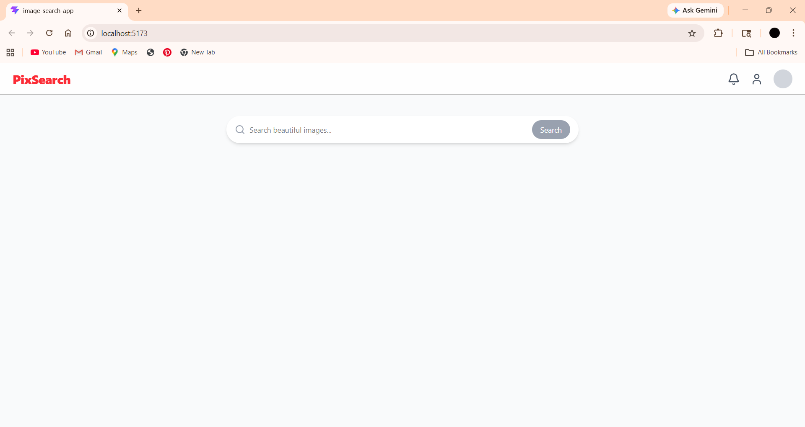
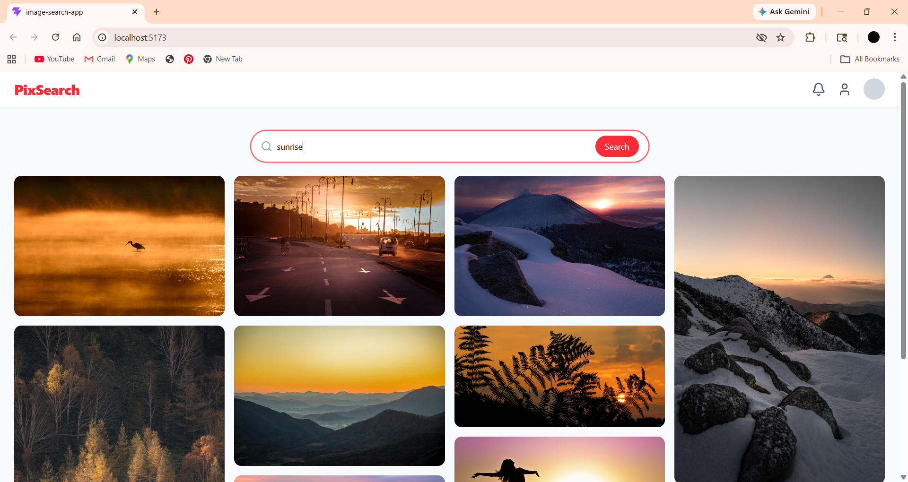

# 📌 PixSearch – Image Search App

PixSearch is a modern, Pinterest-inspired image search application built using React and Tailwind CSS. It allows users to search for high-quality images using the Pixabay API with a smooth and responsive UI.

---

## 🚀 Features

* 🔍 Search images by keyword
* 🧠 Controlled search (button-based, no API spam)
* ⚡ Optimized API calls with caching & deduplication
* 🖼️ Responsive masonry-style image grid
* ⏳ Loading spinner for better UX
* 💤 Lazy loading images to reduce network load
* 🚫 Graceful handling of API rate limiting (429 errors)
* 🎨 Clean, Pinterest-like UI with hover effects

---

## 🛠️ Tech Stack

* **Frontend:** React (Vite)
* **Styling:** Tailwind CSS
* **API:** Pixabay API
* **Icons:** Lucide React
* **HTTP Client:** Axios

---

## 🧠 Performance Optimizations

To handle API and CDN rate limits efficiently:

* ✅ Prevent duplicate API requests
* ✅ Cache previously searched queries
* ✅ Limit number of images per request
* ✅ Lazy load images (`loading="lazy"`)
* ✅ Handle 429 errors gracefully

---

## 📂 Project Structure

```
src/
│── api/
│   └── api.js
│
│── components/
│   ├── Navbar.jsx
│   ├── SearchBar.jsx
│   ├── ImageGrid.jsx
│   └── ImageCard.jsx
│
│── pages/
│   └── Home.jsx
│
│── App.jsx
│── main.jsx
```

---

## ⚙️ Setup Instructions

### 1️⃣ Clone the repository

```bash
git clone https://github.com/your-username/pixsearch.git
cd pixsearch
```

### 2️⃣ Install dependencies

```bash
npm install
```

### 3️⃣ Add environment variables

Create a `.env` file in the root:

```
VITE_PIXABAY_API_KEY=your_api_key_here
```

Get your API key from https://pixabay.com/api/docs/

---

### 4️⃣ Run the app

```bash
npm run dev
```

---

## ⚠️ Known Limitations

* Pixabay free tier has rate limits (429 errors may occur in development)
* Image CDN requests are not fully controllable from frontend
* No backend caching (yet)

---

## 🔮 Future Improvements

* 🌐 Backend proxy with caching (Node.js + Redis)
* ♾️ Infinite scrolling
* 💾 Local storage caching
* 🔎 Search suggestions & history
* ❤️ Save/favorite images feature

---

## 📸 Screenshots




---

## 💡 What I Learned

* Handling real-world API rate limiting
* Optimizing frontend performance
* Designing scalable React components
* Improving UX with loading states and lazy loading

---

## 🧑‍💻 Author

**Ishita Sanap**
Computer Engineering Student

---

## ⭐ If you like this project

Give it a ⭐ on GitHub!
